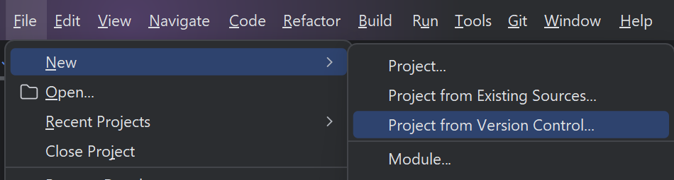
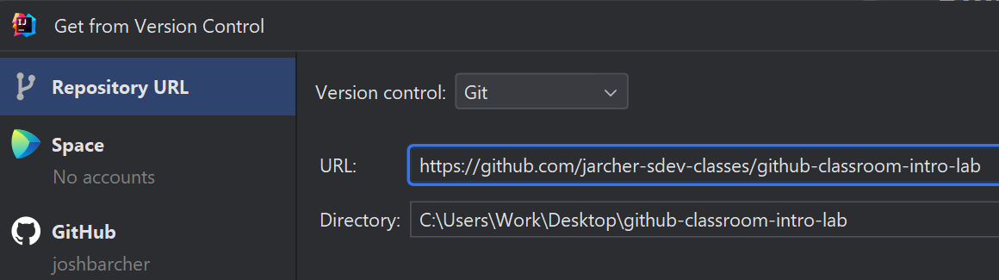
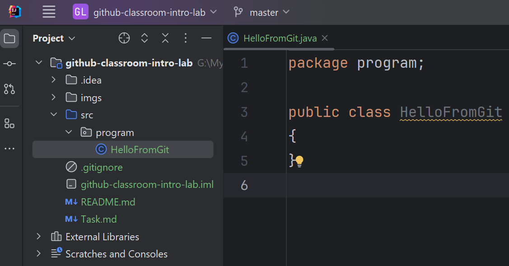
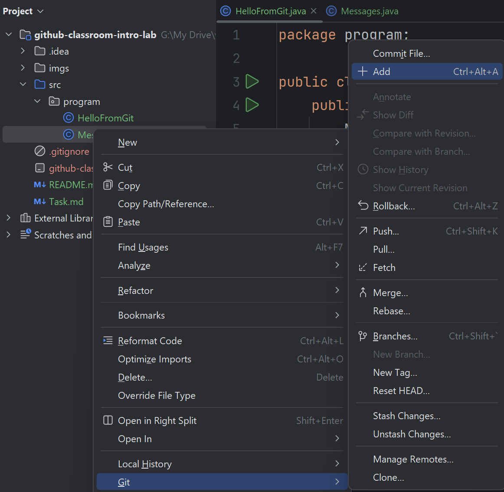
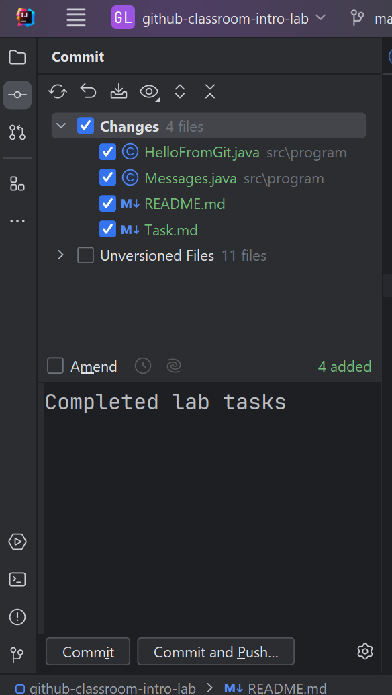
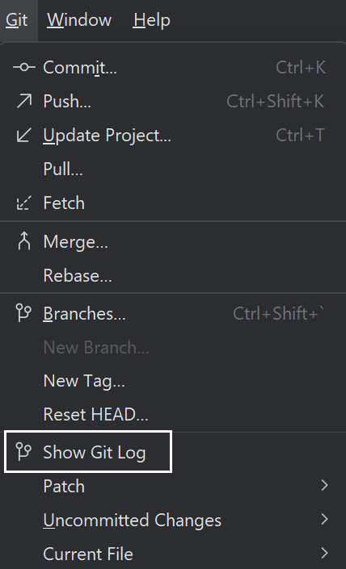
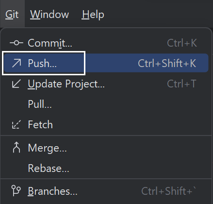

# Lab: Introduction to Github Classroom

## Objective

The goal of this lab is to familiarize you with the basic Git and GitHub operations used in 
conjunction with Github classroom. This will be the primary way in which we submit individual
assignments this quarter. By completing this lab, you will learn how to clone a repository,
make changes, and push those changes back to GitHub. 

## Instructions

### Step 1: Accept the Assignment
1. Click on the assignment link provided by your instructor.
2. Accept the assignment.
3. Once the assignment repository is created for you on GitHub, click on the generated link to navigate to 
   your new repository.

### Step 2: Clone the Repository
1. On your repository page, click the "Code" button and copy the repository URL.
2. In your editor, create a new project from version control.

3. Enter your repository URL and open the project files in your editor.

4. You should now be able to see the project folder contents in your editor.

### Step 3: Make Your Changes
You will find a file named `Task.md`. Open it and complete the tasks listed. These tasks will involve modifying 
the file in some way, such as adding your name or solving a simple coding problem.

### Step 4: Commit Your Changes
1. After completing the tasks, use the editor menu to add any new files to Git.

2. Open up the version control panel and add the commit message "Completed lab tasks". 
   Then choose the commit option.

3. You should be able to see your Git history using the Git log in your editor.

### Step 5: Push Your Changes
1. Push your changes to GitHub using your editor menu.

2. Verify that your changes are reflected in your GitHub repository.

## Submission
Once you have pushed your changes to GitHub, your submission is complete. Your instructors will review the changes 
in your repository to grade your assignment.

## Assistance
If you encounter any difficulties, please reach out to your instructor. 
You can also consult the [Git documentation](https://git-scm.com/doc) and
[GitHub's Help articles](https://help.github.com) for more information.

Good luck, and have fun exploring Git and GitHub!