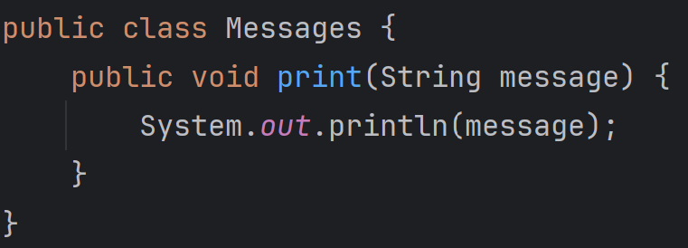
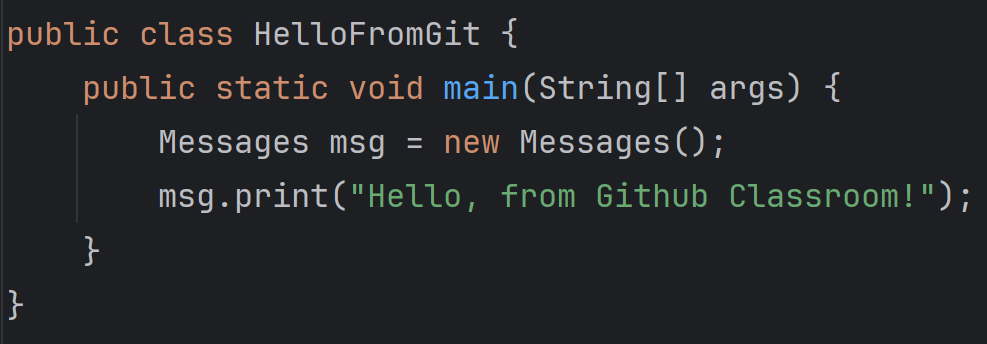

## Task #1
Create a new `Messages` class in the program package that has a print() method,
which can be used to print messages to the Java console.

## Task #2
Use the `Messages` class to print out "Hello, from Github Classroom!" to the
Java console in the HelloFromGit class.

